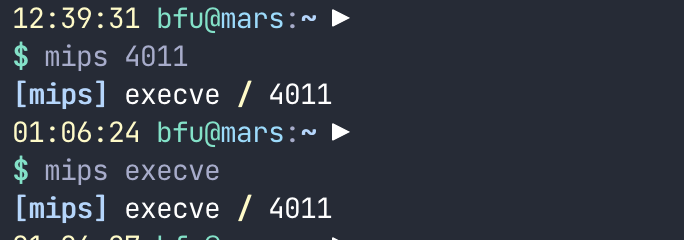

# mipscalls

I keep getting annoyed looking at the mips syscall list. Made a small api for it so that I can query from wherever I please.

## CLI Script
There is a cli script for accessing it [here](https://gist.github.com/bfu4/6d67123f5189deb95a0ae011ce9aed87)



## Querying

### By name
```
https://mips.bella.sh/?name=execve
```
Responds with
```json
{"id":4011,"name":"execve"}
```

### By id

```
https://mips.bella.sh/?id=4011
```

Responds with
```json
{"id":4011,"name":"execve"}
```
